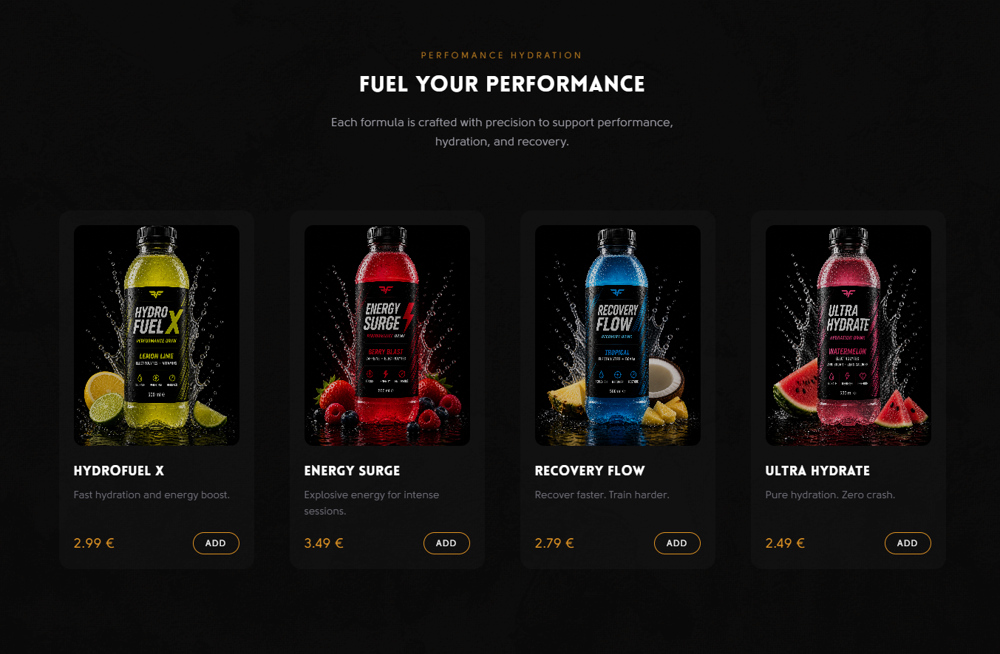
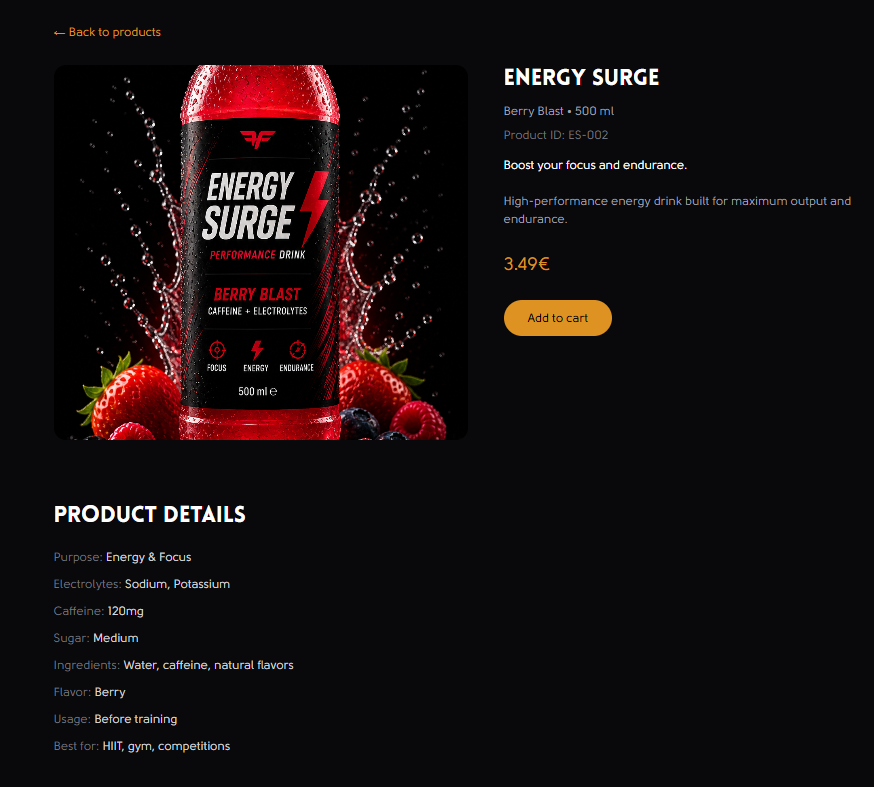

# Hydration Drinks – Sports Brand Showcase

Live: https://sportsdrink.vercel.app/
GitHub: https://github.com/Meripa/sports_drink

A modern sports drink brand website built with React and TypeScript, focused on clean UI, product presentation, and real-world e-commerce structure.

---

## 🚀 Overview

This project simulates a real-world product website for a performance drink brand.

The goal was to design and build a visually polished, responsive interface that showcases products, brand identity, and user flows similar to a modern e-commerce platform.

---

## ✨ Key Features

- Product listing with dynamic data structure  
- Individual product detail pages  
- Reusable component-based architecture  
- Smooth page transitions using Framer Motion  
- Responsive design (mobile + desktop)  
- Contact page with form and map integration  
- Shared layout system (Navbar, Footer, routing)

---

## 🧠 What I focused on

- Clean and modern UI/UX design  
- Consistent brand styling (hydration / energy / recovery concept)  
- Component reusability and structure  
- Realistic product data modeling  
- Frontend architecture for scalability  

---

## 🛠 Tech Stack

- React  
- TypeScript  
- Vite  
- Tailwind CSS  
- React Router DOM  
- Framer Motion  

---

## 📸 Screenshots

(Add images here – homepage, product page, detail page)

---

## 🔧 Future Improvements

- Shopping cart and checkout flow  
- Product filtering and search  
- Backend integration (Node.js / API)  
- Authentication system  
- Admin panel for product management  

---

## 📌 Notes

This project was built as a portfolio piece to demonstrate frontend development skills, UI/UX design, and the ability to create a realistic product-based application.

---